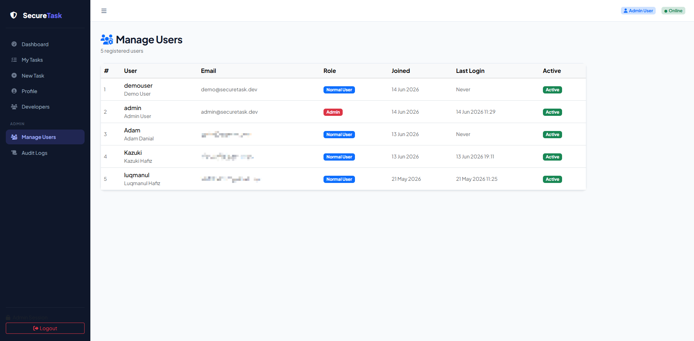
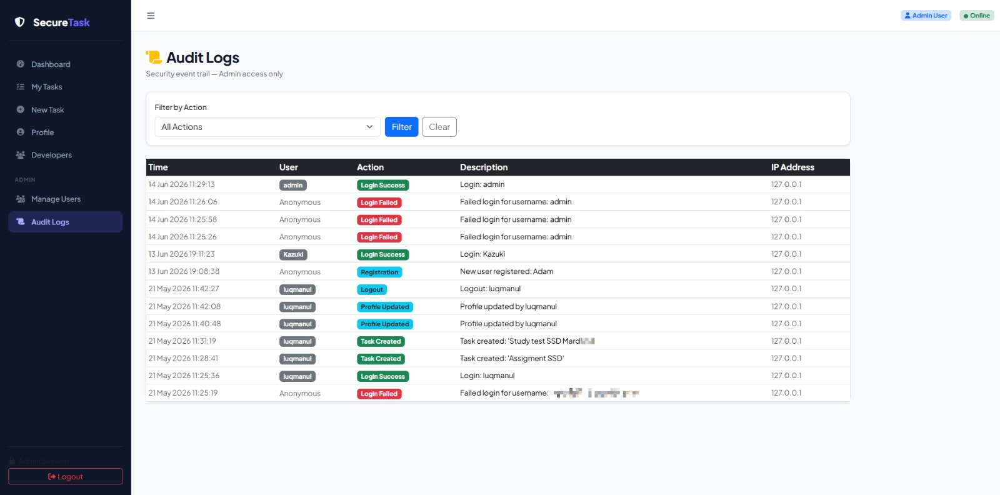

# SecureTask — Secure Task Management System

SecureTask is a secure web-based task management system developed using Django and MySQL, designed according to OWASP Top 10 and OWASP ASVS security practices.

---

## University Information

**University:** UNIKL MIIT
**Course:** Secure Software Development  
**Technology Stack:** Django 4.2 · MySQL · Bootstrap 5 · Django REST Framework

---

## Team Members

| Name                                 |Student ID   | Role                                  |
|--------------------------------------|-------------|---------------------------------------|
| Luqmanul Hafiz Bin Ahmad Fairul      | 52215125409 | Lead Developer & Security Architect   |
| Muhammad Iqbal Bin Ruslan            | 52215125730 | Backend Developer & Database Engineer |
| Muhammad Akmal Hakim bin Mohd Yuzlan | 52215125582 | Frontend Developer & UI/UX Designer   |
| Muhamad Fareez Aiman bin Rozaiman    | 52215125751 | QA Engineer & Security Tester         |

---

## Features

- User Registration & Authentication
- Role-Based Access Control (RBAC)
- Secure Task CRUD System
- REST API Integration
- File Upload Validation
- Audit Logging System
- Session Management
- Brute-force Protection (django-axes)
- Content Security Policy (CSP)
- Secure Password Handling
- Admin Dashboard

---

## Admin Manage User



## Admin Audit Logs



---

## Security Controls Implemented

| OWASP Category | Implementation                                         |
|----------------|--------------------------------------------------------|
| OWASP A01      | RBAC + IDOR prevention                                 |
| OWASP A02      | PBKDF2 password hashing, secrets stored in `.env`      |
| OWASP A03      | ORM-only queries, template autoescaping                |
| OWASP A04      | File validation, UUID filenames, 2MB upload limit      |
| OWASP A05      | CSP headers, secure production configuration           |
| OWASP A07      | django-axes lockout, session timeout, strong passwords |
| OWASP A09      | Secure audit logging (no sensitive data stored)        |

---

## Prerequisites

- Python 3.10+
- MySQL 8.0+
- pip

Optional:
- MySQL Workbench
- Visual Studio Code

---

## Windows Setup Guide

### 1. Extract Project
```powershell
cd securetask
```
### 2. Create Virtual Environment
```powershell
python -m venv venv
```
### 3. Activate Virtual Environment
```powershell
venv\Scripts\activate
```
### 4. Install Dependencies
```powershell
pip install -r requirements.txt
```
### 5. Install Windows Fix
```powershell
pip install python-magic-bin
```
### 6. Configure Environment File
```powershell
copy .env.example .env
```
Edit `.env`:
```powershell
SECRET_KEY=change-me
DEBUG=True
DB_NAME=securetask_db
DB_USER=root
DB_PASSWORD=yourpassword
DB_HOST=127.0.0.1
DB_PORT=3306
```
### 7. Create Database
```SQL
CREATE DATABASE securetask_db CHARACTER SET utf8mb4;
```
### 8. Run Migrations
```powershell
python manage.py makemigrations accounts tasks
python manage.py migrate
```
### 9. Create Superuser
```powershell
python manage.py createsuperuser
```
### 10. Run Server
```powershell
python manage.py runserver
```
Open:
```powershell
http://127.0.0.1:8000
```
---

## Linux / macOS Setup
```bash
python3 -m venv venv
source venv/bin/activate
pip install -r requirements.txt
cp .env.example .env

mysql -u root -p -e "CREATE DATABASE securetask_db CHARACTER SET utf8mb4;"

python manage.py makemigrations accounts tasks
python manage.py migrate
python manage.py createsuperuser
python manage.py runserver
```
---

## Start Server
```powershell
cd securetask
venv\Scripts\activate
python manage.py runserver
```
---

## Stop Server
```powershell
CTRL + C
```
---

## API Endpoints (v1)

| Method         | Endpoint              | Description                 |
|----------------|-----------------------|-----------------------------|
| GET/POST       | /tasks/               | List/Create tasks           |
| GET/PUT/DELETE | /tasks/{id}/          | Retrieve/Update/Delete task |
| POST           | /tasks/{id}/complete/ | Mark task complete          |
| GET            | /users/               | Admin user list             |
| GET            | /audit-logs/          | Audit logs                  |

---

## Authentication

Session Authentication  
Token Authentication

---

## Project Structure
```text
securetask/
├── config/
├── accounts/
├── tasks/
├── api/
├── templates/
├── static/
├── media/
├── logs/
├── manage.py
├── requirements.txt
└── .env.example

```
---

## Common Issues & Fixes

mysql command not recognized:
C:\Program Files\MySQL\MySQL Server 8.0\bin

No module named 'magic':
pip install python-magic-bin

Table does not exist:
python manage.py makemigrations
python manage.py migrate

---

## Development Notes

DEBUG = True for development  
Production must use:
- DEBUG = False
- HTTPS enabled
- Secure cookies enabled
- HSTS enabled

---

## Security Notes

- Never commit .env to GitHub
- Passwords hashed using Django auth
- UUID filenames for uploads
- CSP headers enabled
- Secure sessions enabled

END
---

## Authors

Developed for educational and cybersecurity learning purposes at University of Kuala Lumpur MIIT.
